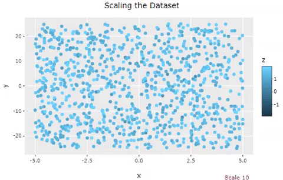

# Harvard Data Science Animation Contest Sumbission

# Scaling a randomized dataset in an animated way.
**Author**: Michel Benites Nascimento

**Affiliation**: Havard Extension School
##

**Artifact:**

**Code:** *[link to code file](CodeExamples/michelnascimento_code.Rmd) from repo*

### Explanation

The main purpose here is to show how the scale command works in a dataset. This command converts the data into Z-scale. In statistics it is very important to transform the data in Z-scale before analyzing them, thus obtaining a normalization of the dataset. When you have data of different magnitudes (for instance, kilometers, seconds, temperature etc...) makes all sense converts them into a more homogenous distribution facilitating the analysis and the input of these data in some algorithms. 

Graphically I’m showing a dataset that was created in a random way with a uniform distribution that is gradually being scaled (steps of 10%). Initially, we have for the X-axis values between -5 and 5 and for Y values between -25 and 25. At the end of the procedure of scaling the dataset, we will have both X and Y values between -2 and 2, without losing the proportionality. Essential when you want to use regularization methods like LASSO and Ridge.

